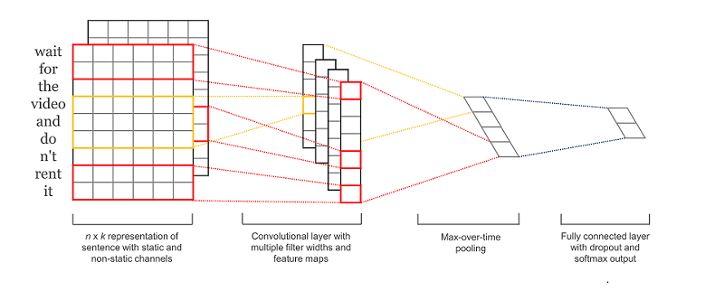
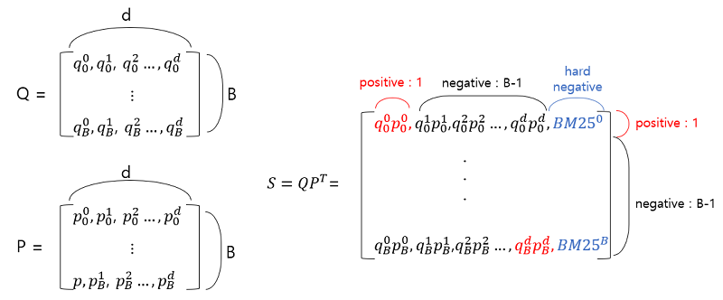

## Task 소개

- **Open-Domain Question Answering(ODQA)** 는 주어지는 지문이 따로 존재하지 않고 사전에 구축 되어 있는 knowledge resource 에서 질문에 대답할 수 있는 문서를 찾아 다양한 종류의 질문에 대답하는 인공지능을 만드는 Task 입니다.


- 평가 방법
    - **Exact Match(EM)** : 모델의 예측과 실제 답이 정확하게 일치할 때만 점수가 주어짐
    - **F1-Score** : EM과 다르게 겹치는 단어도 있는 것을 고려해 부분 점수를 받음

## 데이터 소개

아래는 제공하는 데이터셋의 분포를 보여줍니다.


데이터셋은 편의성을 위해 Huggingface 에서 제공하는 datasets를 이용하여 pyarrow 형식의 데이터로 저장되어있습니다. 다음은 데이터셋의 구성입니다.

```bash
./data/                        # 전체 데이터
    ./train_dataset/           # 학습에 사용할 데이터셋. train 과 validation 으로 구성 
    ./test_dataset/            # 제출에 사용될 데이터셋. validation 으로 구성 
    ./wikipedia_documents.json # 위키피디아 문서 집합. retrieval을 위해 쓰이는 corpus.
```

data에 대한 argument 는 `arguments.py` 의 `DataTrainingArguments` 에서 확인 가능합니다. 

## Pre-train
Salient Span Masking(SSM) 은 REALM에서 제시된 pretraining방법으로 인물, 날짜, 장소, 수량과 같을 Named Entity를 Masking하여 모델이 QA task에 적합한 world knowledge를 더 잘 학습할 수 있도록 한다.

  details : [링크](./ssm/README.md)


## Reader


### CNN Layer
 CNN은 토큰의 지역적인 특징을 반영할 수 있다. 이를 이용하여, 모델이 좀더 제대로 위치를 예측할 수 있도록 CNN 을 모델 끝에 추가함.
  
 
### Curriculum Learning
Curriculum Learning에서는 데이터의 난이도에 따라 데이터 종류를 상/중/하로 나누고  난이도 하, 난이도 중, 난이도 상 순서로 데이터를 학습함.
* klue/roberta-large로 1차 inference를 진행하여 train dataset에 대한 예측값을 계산
* start_index와 end_index 예측값에 대해 각각 L2 Loss를 계산 하여 산출된 Loss를 기준으로 각각의 훈련 데이터에 대해 난이도를 선정

## Retriver

### Sparse Retriever
Sparse Retriever는 Elastic Search를 사용

* 설치방법
```
bash ./elastic_search_install.sh
```
* Basic setting (상세사항은 ./retriever/setting.json 참조)
```
filter : shingle
tokenizer : nori_tokenizer
decompound_mode : mixed
similarity : BM25
```

### Dense Retriever
Encoder 모델로 encoding한 query, passage의 representation을 dot_product하여 나온 값으로 query와 passage의 유사도를 학습시킴
* in-batch-negative, in-batch-negative + hard-negative 방법을 이용


## Post processing

```
bash ./konlpy_install.sh
```

모델이 출력한 예측값에 konlpy 라이브러리를 적용하여 형태소 분석을 합니다.

Mecab, Hannanum, Okt 형태소 분석기를 사용해 예측값의 형태소를 출력합니다.

3가지 분석기 중에 Okt를 포함한 2가지 이상 분석기에서 예측값이 조사로 끝나는 것으로 나타난 경우엔 해당 조사를 제거합니다.

조사가 제거된 예측 결과는 --output_dir 위치에 predictions_post.json 파일로 저장됩니다.


## How to run

### train
```
python train.py --config base_config
```
### How to submit
inference.py 파일을 위 예시처럼 --do_predict 으로 실행하면 --output_dir 위치에 predictions.json 와 predictions_post.json 라는 파일이 생성됩니다. 해당 파일을 제출해주시면 됩니다.

## Competition Score
|Rank|EM|F1_score|
|------------------|-----------------------|-------|
|***5***|65.56|77.25|

