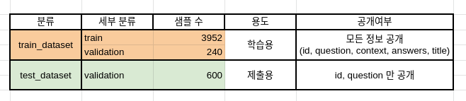

## Task 소개

- **Open-Domain Question Answering(ODQA)** 는 주어지는 지문이 따로 존재하지 않고 사전에 구축 되어 있는 knowledge resource 에서 질문에 대답할 수 있는 문서를 찾아 다양한 종류의 질문에 대답하는 인공지능을 만드는 Task 입니다.


- 평가 방법
    - **Exact Match(EM)** : 모델의 예측과 실제 답이 정확하게 일치할 때만 점수가 주어짐
    - **F1-Score** : EM과 다르게 겹치는 단어도 있는 것을 고려해 부분 점수를 받음

## 데이터 소개

아래는 제공하는 데이터셋의 분포를 보여줍니다.



데이터셋은 편의성을 위해 Huggingface 에서 제공하는 datasets를 이용하여 pyarrow 형식의 데이터로 저장되어있습니다. 다음은 데이터셋의 구성입니다.

```bash
./data/                        # 전체 데이터
    ./train_dataset/           # 학습에 사용할 데이터셋. train 과 validation 으로 구성 
    ./test_dataset/            # 제출에 사용될 데이터셋. validation 으로 구성 
    ./wikipedia_documents.json # 위키피디아 문서 집합. retrieval을 위해 쓰이는 corpus.
```

data에 대한 argument 는 `arguments.py` 의 `DataTrainingArguments` 에서 확인 가능합니다. 

## 파일 구성


### 저장소 구조

```
to-do
```

## Reader

### Salient Span Masking

### CNN Layer

### Curriculum Learning

## Retriver

### Sparse Retriever

### Dense Retriever

## 훈련, 평가, 추론

### train
```
python train.py --config base_config

```
### How to submit

`--output_dir` 위치에 `predictions.json` 이라는 파일이 생성됩니다. 해당 파일을 제출해주시면 됩니다.

